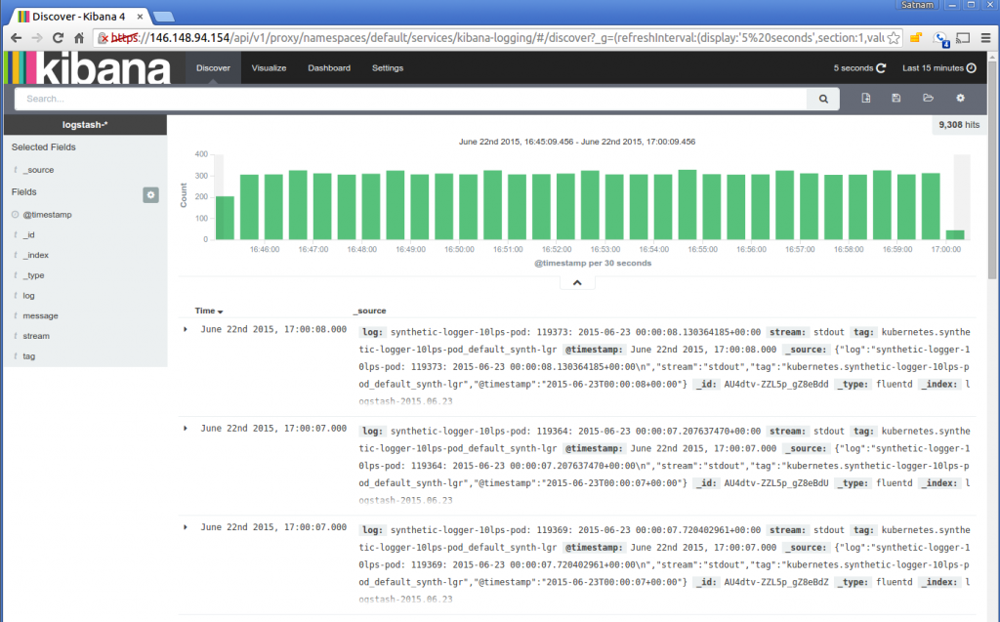

# 모니터링

## 목적
> 서비스 과정에서 발생할 수 있는 문제점을 탐색하는 것. 고객이 발견하기 전에 먼저 발견하는 것.<br>
> 고객이 먼저 발견 === 고객의 실망

### 모니터링을 도와주는 솔루션을 선택하는 방법
> 모니터링에 필수적인 요인을 탐색한 이후, 추가적인 기능에 눈을 돌려야 한다.<br>
> 서버 리소스를 분석하는 기능이 없는 모니터링 솔루션에 문제 발생시 slack알림 기능만 있는 것은 쓸모가 없다!

#### 기본적인 모니터링 요인의 예
> cpu, 서버 램, 지난 1분 간의 에러 수, 프로세스 재시작 횟수, 평균 응답시간 등

### 상용 제품을 사용하는데 있어서 체크 포인트
> 기본적인 요인들을 확인하는 것도 쉬운 것은 아니다. <br>
> AWS CloudWatch, Google StackDriver의 경우 하드웨어에 관한 정보를 즉각적으로 알려주지만, 앱 내부 상황에 대해서는 알려주지 않는다.<br>
> ElasticSearch같은 log-based 제품의 경우에는 디폴드 값으로는 하드웨어 정보를 알기 쉽지 않다.<br>
> 그래서 Elastic stack에 어플리케이션 로그를 보내거나, Beat같은 추가적인 기능을 사용하는 방법을 대체로 따르고 있다.<br>

### 모니터링 예: AWS cloudwatch default dashboard


## 스마트 로깅
> 로그는 의미없는 디버그 덩어리일 수도, 대시보드에 앱의 상태를 나타내게 하는 데이터일 수도 있다.<br>
> 기획단계에서 로그의 수집, 저장에 대한 고민이 필요하다.<rb>
> 다음 세가지의 요구 사항을 따라야 한다.

### smart logging
> 적어도 winston, bunyan같은 알려진 모듈을 사용해야 한다. 처리 과정 앞뒤로, 의미 있는 정보가 기록되어야 한다.<br>
> JSON형식으로 기록하고, 로그가 찍힐 당시의 상황을 담은 프로퍼티가 있어야 한다.<br>
> 이를 이용하여 운영팀에서 쉽게 사용할 수 있어야 한다.<br>
> 각 처리(transaction)에 대한 id가 로그에 기록되어야 한다.<br>
> elastic beat같은 시스템 상태(cpu, 메모리)를 기록하는 agent를 고려해야 한다.

### smart aggregation
> 서버에 로그를 쌓기 시작한다면, 주기적으로 로그를 종합해야한다.<br>
> 정보의 효용성을 높여준다. elastic stack은 좋은 선택이 될 수 있다.

### smart visualization
> 에러 발생률, 평균 일일 cpu througout, 지난 한 시간동안 올마나 많은 신규 유저가 가입했는지, 볼 수 있다. 우리의 서비스를 더 발전시킬 수 있다.

### Elastic stack?
> shay banon이 만든 오픈소스 분석 및 검색 엔진 Elasticsearch, 다양한 소스로부터 데이터를 수집하는 logstash, 데이터를 시각화하는 kibana 이 셋을 합쳐서 ELK stack라고 부르던 것을 elastic stack으로 제품화 한 것.<br>
[Elastic stack 공식문서](https://esbook.kimjmin.net/01-overview/1.1-elastic-stack)

> elastic search: 데이터 인덱싱, 저장, 검색, 집계 등을 수행, 결과를 클라이언트 or 다른 프로그램으로 전달<br>
> logstash: 데이터 수집기  <br>
> kibana: 시각화 툴<br>
> beat: logstash보다 가벼운 데이터 수집기

## 시각화 예: kibana의 로그 검색 기능(Discover)


## 시각화 예: kibana의 시각화 기능


### 로그는 반드시
1. 각 라인에 timestamp가 필요하고, 해당 로그 자체만으로 이해가 되어야 한다.<br>
2. 이해하기 쉬어야 한다.<br>
3. 파일로 저장하거나, 문자로 전송되는 등의 다양한 흐름이 존재해야 한다.

## reverse proxy에 위임해라
> node는 cpu집약적인 작업에 약하다. node는 싱글 스레드 모델이기 때문에, serving static files, gzip encoding, throttling requests, SSL termination 같은 미들웨어를 모두 추가하면 서버가 멈춘다.<br>
> 네트워킹 작업을 위해서는 네트워킹 작업에 특화된 nginx같은 서비스를 사용하는게 좋다.


### 리버스 프록시란?
> 웹 서버 앞에 존재<br>
> 로드 밸런싱에 사용, IP를 노출하지 않아서 보안 상승, 리버스 프록시에 데이터 캐싱 되어있어서 성능 향상, SSL암호화-> 연산 비용이 높은데 이를 대신할 경우 서버 성능이 좋아진다.<br>
> 대표적으로 nginx가 있다. 여기에 가능한 모든 작업을 위임하자.

## 의존성을 잠궈라(lock dependencies)
> npm 설치 시에 기본적으로 패키지의 최신 버전을 가져오기 때문에 환경간에 종속성이 달라질 수 있다.<br>
> shrinkwrap이라는 파일을 사용하라고 하지만 지금은 package-lock파일로 고정할 수 있다.

### dependencies lock file – package-lock.json

```json
{
    "name": "package-name",
    "version": "1.0.0",
    "lockfileVersion": 1,
    "dependencies": {
        "cacache": {
            "version": "9.2.6",
            "resolved": "https://registry.npmjs.org/cacache/-/cacache-9.2.6.tgz",
            "integrity": "sha512-YK0Z5Np5t755edPL6gfdCeGxtU0rcW/DBhYhYVDckT+7AFkCCtedf2zru5NRbBLFk6e7Agi/RaqTOAfiaipUfg=="
        },
        "duplexify": {
            "version": "3.5.0",
            "resolved": "https://registry.npmjs.org/duplexify/-/duplexify-3.5.0.tgz",
            "integrity": "sha1-GqdzAC4VeEV+nZ1KULDMquvL1gQ=",
            "dependencies": {
                "end-of-stream": {
                    "version": "1.0.0",
                    "resolved": "https://registry.npmjs.org/end-of-stream/-/end-of-stream-1.0.0.tgz",
                    "integrity": "sha1-1FlucCc0qT5A6a+GQxnqvZn/Lw4="
                }
            }
        }
    }
}
```
## 도구를 사용하여 프로세스를 유지해라
> 노드 프로세스가 멈출 경우, 재시작 되는 과정은 반드시 준비되어 있어야 한다.<br>
> 컨테이너를 사용하지 않는 작은 서비스의 경우에는 PM2만으로도 충분하다.<br>
> 그러나 도커와 같은 컨테이너 기술을 사용한 이후로는 ECS나 k8s같은 클러스터 관리 도구가 필요하다.<br>
> 클러스터 관리 도구를 사용하더라도 PM2를 컨테이너 안에 유지하는게 작은 에러에서는 효율적인 대응이 될 수 있다.<br>
> ECS: Amazon에서 제공하는 컨테이너 관리 툴

## 모든 cpu를 사용해라
> 기본적으로 노드 어플리케이션은 싱글 스레드 -> 하나의 CPU코어에서만 실행된다.<br>
> 소규모 어플리케이션은 노드 클러스터, PM2를 사용. 대규모의 경우 Docker 클러스터(k8s, ECS)를 사용<br>
> 작은 규모의 서비스는 코드 10줄 만으로 노드 클러스터를 사용하면 된다.<br>
> 노드 클러스터는 논리적 코어를 생성하여 라운드 로빈 방식으로 프로세스를 라우팅 한다.<br>
> 보다 멋진 UI를 제공하는 PM2를 사용해도 된다.<br>
> 더 발전된 방법으로는 nginx를 이용해서 노드 프로세스를 복제하는 방법을 사용할 수도 있고,<br>
> ECS, K8s같은 컨테이너 엔진을 이용해서 프로세스 복제와 배포를 할 수도 있다.<br>